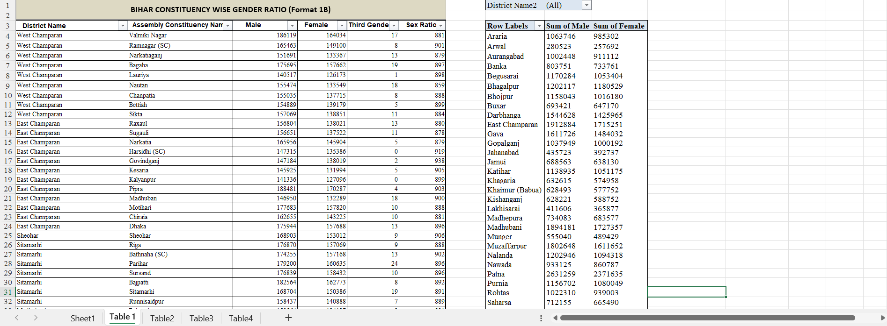
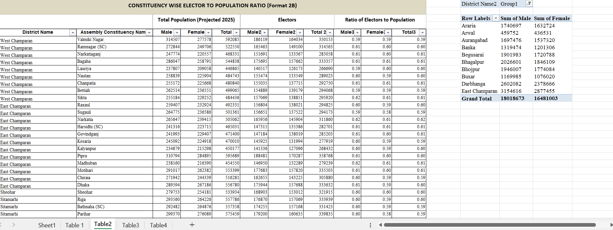
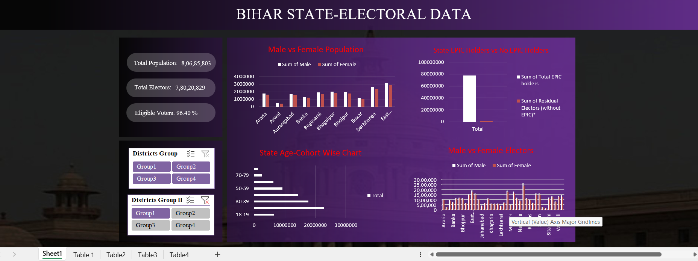
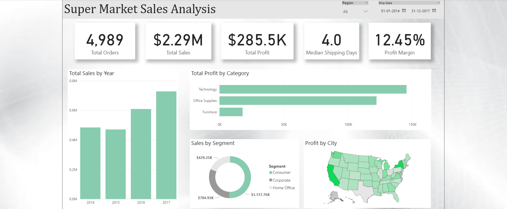

# Data-Analysis-Dashboards
This repository contains **Excel and Power BI dashboards** showcasing my **data analysis and visualization** projects.

The projects demonstrate my skills in data cleaning, analysis, and visualization, with a focus on building clear, insightful, and interactive reports.  

📌 Each project folder contains:  
- An **exported PDF or presentation** for quick preview 
- A **screenshot/preview image**  
- A short description of the insights covered  

These projects highlight my learning journey and serve as part of my **portfolio as a Data Analyst fresher**.  

---

## 📊 Excel Dashboard

### Bihar-State Electoral Dashboard
- **Tool:** Excel  
- **Objective:** Analyse age-cohort wise electors, male vs female population and electors, and EPIC holders 
- **Preview:**  
  
  
  

- **File:**  
  - [Excel File (.xlsx)](Excel-Dashboard/Bihar-State-Electoral-Dashboard.xlsx)

---

## 📊 Power BI Dashboard

### Super Market Sales Dashboard
- **Tool:** Power BI  
- **Objective:** Analyze sales and profit across regions, categories, and customer segments.  
- **Preview:**  
    

- **Files:**  
  - [PPT Export](PowerBI-Dashboard/Super-Market-Dashboard-Presentation.pptx)  
  - [PowerBI File (.pbix)](PowerBI-Dashboard/Super-Market-Sales-Analysis-Dashboard.pbix)
